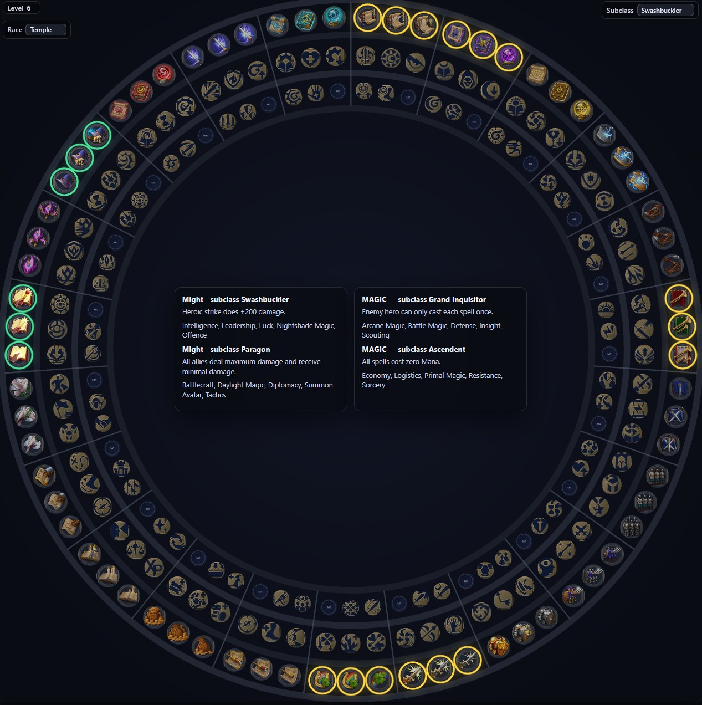

# Heroes of Might and Magic - Olden Era | Skillwheel

## Utilisation

 - Télécharger le dossier icons et le fichier skillwheel.html
 - Les placer dans un dossier commun
 - Ouvrir le fichier skillwheel.html avec un navigateur web
 
## Fonctions

 - Passer la souris sur une compétence pour lire sa description
 - Cocher les compétences pour les surligner en vert
 - Sélectionner une classe en haut à gauche pour avoir la description des sous-classes
 - Sélectionner une sous-classe en haut à droit pour surligner en jaune les compétences associées

## Crédits

Traduit par Morrock pour ArchangelCastle, d'après le travail original de Immortalone <https://github.com/Deathaim2610/HOMM-Olden-Era-skillwheel/>
